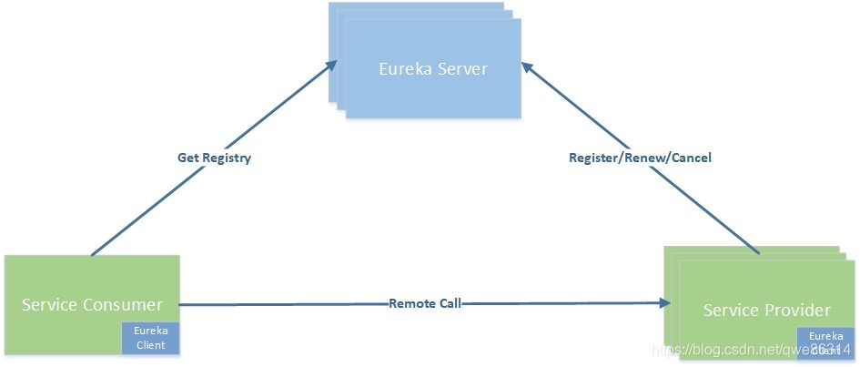

# springcloud

## Eureka

Spring Cloud 封装了 Netflix 公司开发的 Eureka 模块来实现服务治理。  
在传统的RPC远程调用框架中，管理每个服务与服务之间依赖关系比较复杂，所以需要使用服务治理，可以实现服务调用、负载均衡、容错等，实现服务注册与发现。  
Eureka Server 作为服务注册功能的服务器，它是注册服务中心，而系统中的其他微服务使用Eureka的客户端连接到 Eureka Server 并维持心跳链接。  
在服务注册与发现中，有一个注册中心。当服务器启动的时候，会把当前服务器的信息以别名方式注册到注册中心。另一方（消费者|服务提供者）以该别名的方式去注册中心上获取实际的服务通讯地址，然后再实现RPC远程调用。  
  

